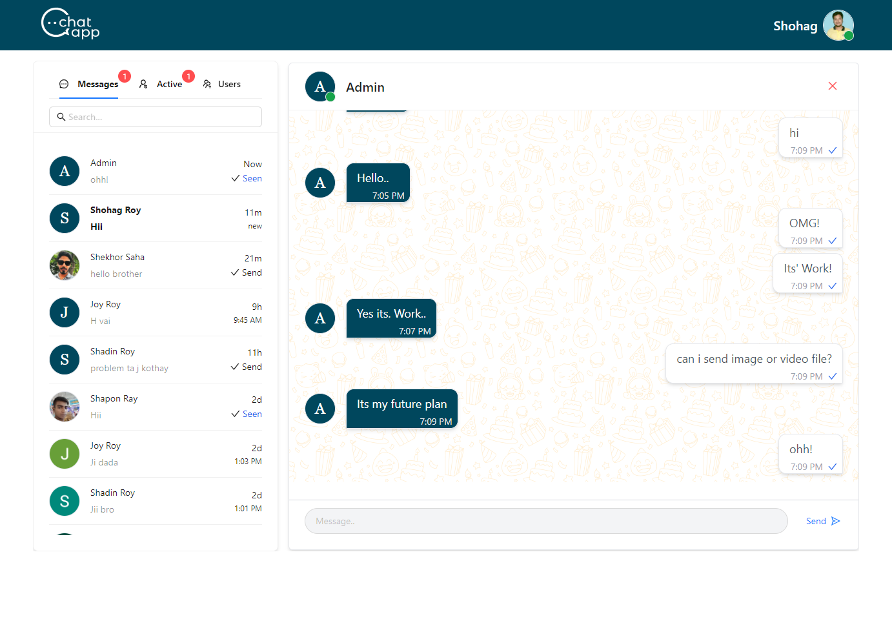

## Real Time Chat Application - React, Redux, Socket.io

Project Overview

### Description

This Chat applocation is a real-time messaging application developed for seamless communication between users. It offers a secure and interactive platform for instant messaging.

## Screenshots

### Chat Interface



### Login Page


### Register Page


### Purpose

This project demonstrates proficiency in full-stack development, emphasizing real-time features, user authentication, and database management. It showcases the ability to create a user-friendly and dynamic web application.

- [Live Website Link](https://free-chat-application.vercel.app/)
- [Client-side Git Repo](https://github.com/shohagroy/chatting-app)
- [Server-side Git Repo](https://github.com/shohagroy/chatting-app-server)

### Key Features

- **Real-time Messaging:** Users can engage in real-time with friends and contacts.

- **User Authentication:** Secure user registration and login systems manage on firebase auth.

- **Online/Offline Status:** Users can see the online/offline status in all users.

- **Message Sent Status:** Users can see when a message has been successfully sent.

- **User Message Seen Status:** Users can track when their messages have been seen by the recipient.

- **User Profiles:** Each user has a profile with a profile picture, name, and status message.

- **Message History:** Chat history is saved for easy reference and continuity of conversations.

- **Emojis:** Users can send emojis making conversations expressive and engaging.

- **Responsive Design:** Fully responsive, providing an optimal experience on various devices, including desktops and smartphones.

### Login

- **Email:** admin@gmail.com

- **Password:** 123456

### Technologies Used

**Frontend:**

- React.js
- Redux
- Sweetalert
- React-hot-toast
- Socket.io-client

**Backend:**

- Node.js with Express.js
- Authentication: Passport.js
- Database: MongoDB for storing user profiles and message history
- Real-time Communication: Web Socket technology for instant message delivery.

### Design Philosophy

The app prioritizes a clean and intuitive user interface with a modern and user-friendly design.

### Security

Robust user authentication and data encryption practices ensure user data privacy.

### Future Enhancements

Future plans for the Free Chat app include:

- Message search
- Voice and video calls
- File and multimedia content sharing
- User experience enhancements
- Additional security measures

---

### Message Sent and Seen

This Application provides indicators for message delivery and seen status. Messages show two checkmarks when delivered and turn blue when seen by the recipient.

### Message Time

Each message displays a timestamp indicating when it was sent. The time format follows the standard 12-hour clock (e.g., 5:34 PM).

### Firebase User Authentication

User authentication is managed using Firebase for enhanced security and streamlined user management.

## License

This project is licensed under the MIT License. See the [LICENSE](LICENSE) file for details.

## Installation

1. Clone the repository.

```bash
git clone https://github.com/shohagroy/chatting-app.git
cd chatting-app


```

## Contact Information

If you have any questions or need further assistance, please feel free to contact us. We're here to help!

- **Facebook:** [Facebook](https://www.facebook.com/shohagroy.7771/)
- **Linkedin:** [Linkedin](https://www.linkedin.com/in/shohag-roy/)
- **Email:** pkshohag240@gmail.com

I hope you have a great day and enjoy exploring my Realtime Chat application!
